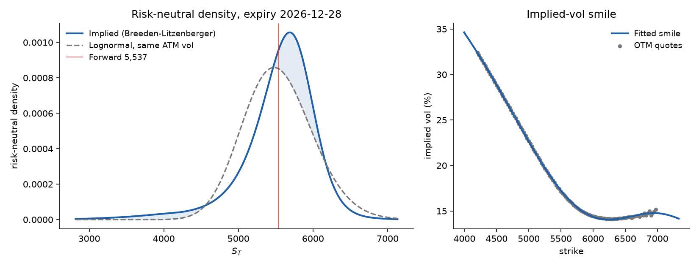

# fearcurve: implied risk-neutral distributions

[](https://github.com/CH4RL3I/fearcurve/actions/workflows/ci.yml)  

Recover the market-implied probability distribution of an asset's future price from a single expiry of option quotes, using the Breeden-Litzenberger relation.



*Synthetic SPX-like chain (generated by `examples/generate_spx_smile.py`, 91 days). The negative skew moves probability mass into the left tail relative to a lognormal with the same ATM vol.*

## The math

For a European call with price $C(K)$, strike $K$, maturity $T$ and rate $r$, the risk-neutral density of $S_T$ is

$$q(K) = e^{rT}\,\frac{\partial^2 C}{\partial K^2}.$$

Second derivatives of raw market quotes are dominated by noise, so the code does not difference quotes directly:

1. Estimate the forward $F$ from put-call parity, $F = K + e^{rT}(C - P)$.
2. Take the out-of-the-money option at each strike and invert Black-76 for its implied vol.
3. Fit a smooth smile to total variance $\sigma^2 T$ as a polynomial (or smoothing spline) in $k = \ln(K/F)$, with a $C^3$ extension beyond the quoted strikes.
4. Rebuild call prices on a fine strike grid from the smooth smile and take the second difference.
5. Clip negative density, report the integral before renormalising, then renormalise to 1.

## Quickstart

```bash
uv sync                      # add --extra data for the yfinance loader (experimental)
uv run rnd fit examples/spx_like.csv --rate 0.04 --asof 2026-09-28 --spot 5500 --plot out.png
```

```
Forward                 5,537.07
ATM implied vol         16.93%
Integral before renorm  0.9988
Mean                    5,540.80
Std dev                 511.48
Skewness                -1.303
Excess kurtosis         3.495
P(S_T < 0.90 * S0)      10.05%
P(S_T > 1.10 * S0)      11.08%
```

Input CSV columns: `expiry`, `strike`, `type` (`call`/`put` or `c`/`p`), and either `bid` and `ask` or `mid`. An optional `spot` column is used if `--spot` is not given. Quotes with a zero bid are dropped. Use `--expiry` if the file has several expiries, `--method spline` for a smoothing spline, `--degree` for the polynomial degree (default 5).

Python API:

```python
from rnd import load_quotes, estimate_density

d = estimate_density(load_quotes("examples/spx_like.csv"), T=91 / 365, rate=0.04, spot=5500)
d.mean, d.std, d.skew, d.prob_below(0.9 * 5500)
```

Live data (needs a network, not used in tests): `uv sync --extra data`, then `uv run rnd fetch SPY --expiry 2026-12-18 --out spy.csv` and fit the CSV as above.

## How it is validated

`uv run pytest` runs 15 tests. The important ones price options from a known model, so the reference answer does not depend on the code under test:

- **Black-Scholes case.** Quotes from a flat-vol model must give back the analytic lognormal density: forward within 1e-9, integral before renormalising within 1e-3 of 1, mean within 0.1%, std within 0.5%, pointwise error below 0.2% of the peak, and CDF probabilities matching the lognormal CDF.
- **Noisy quotes.** Implied-vol noise plus a bid-ask spread is added; both smoothers still recover the density (mean within 0.5%, std within 3%, pointwise error under 5% of the peak). A companion test shows that naive second differences of the same noisy prices are more than 5 times worse.
- **Skewed smile.** Compared with Breeden-Litzenberger applied to the exact smile, plus a check for negative skew.
- **Mutation check.** Dropping the $e^{rT}$ factor makes four tests fail.

## Limitations

- **European-style prices.** The formula assumes European exercise. Listed single stocks and ETFs are American, so early-exercise premium biases the result; index options (SPX) are European. OTM options limit but do not remove this.
- **Tails come from extrapolation.** Outside the quoted strikes there is no information. The extension is a smooth, arbitrary choice, so tail probabilities (e.g. $P(S_T < 0.8 S_0)$) are the least reliable output. Probabilities near the money are robust.
- **No arbitrage constraints.** The fitted smile is not forced to be free of butterfly arbitrage. Negative density is clipped and reported, not prevented. A low-order polynomial can also miss sharp curvature near the money, a spline can chase noise; `--method` and `--degree` are the knobs.
- **Rates and dividends.** One flat continuously compounded `--rate` is used for discounting. Dividends and borrow costs enter only through the parity-implied forward. `--div-yield` is used just to derive spot from the forward when no spot is supplied. The density is under the risk-neutral measure, not a forecast.
- **Mid quotes.** Bid-ask midpoints are treated as prices; wide or stale quotes in the wings are not down-weighted.

## Layout

```
src/rnd/   bs.py (Black-76, implied vol)   quotes.py (CSV, forward, smile points, yfinance)
           density.py (smile, Breeden-Litzenberger)   plot.py   cli.py
examples/  generate_spx_smile.py, spx_like.csv
tests/     validation and I/O tests
```

MIT licence, Emilio Gappa 2026.
